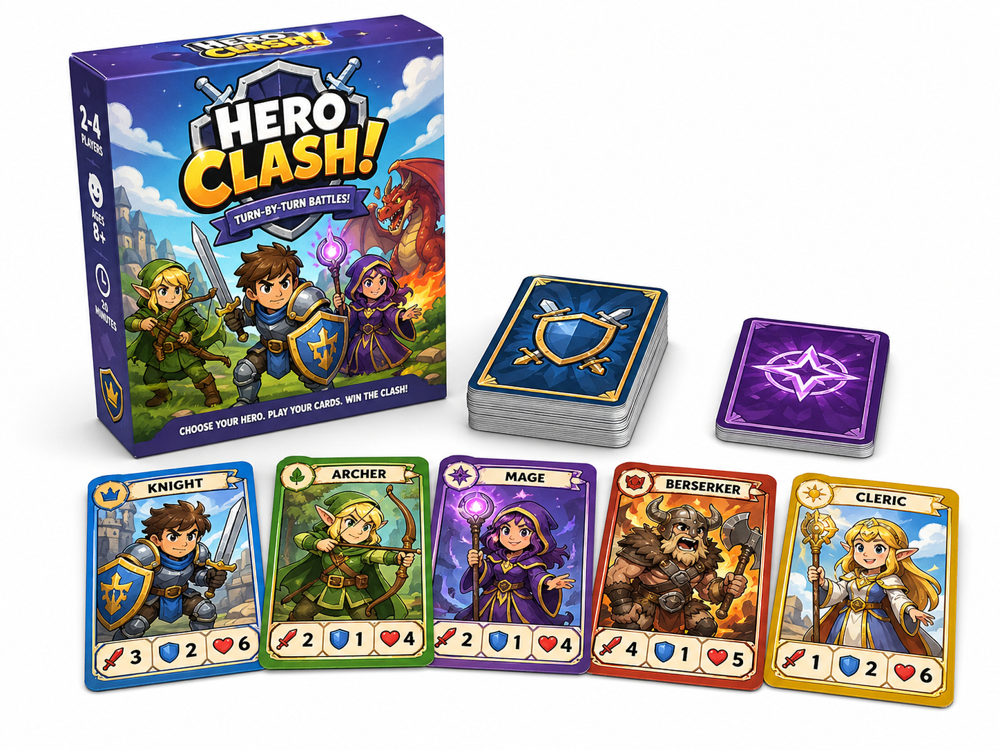
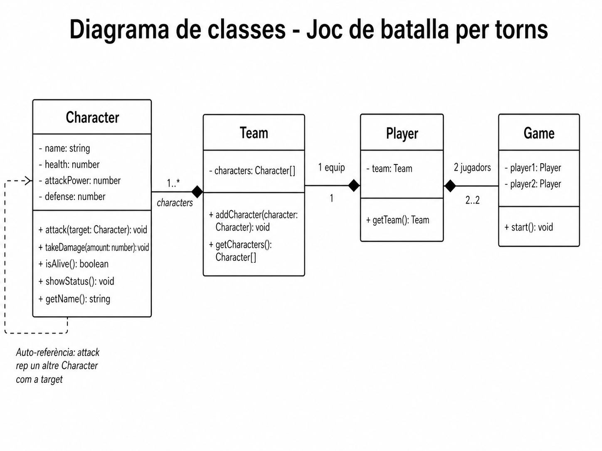

# Projecte joc de batalla

En aquest projecte caldrà fer un joc programat en TypeScript en què dos jugadors lluiten per torns. 

Caldrà crear una interfície atractiva i fàcil d'utilitzar per als usuaris, tot garantint la qualitat del codi i la seva eficiència. 



## Especificacions

El joc de batalla consistirà en una lluita entre dos jugadors on cada jugador disposarà de tres pesonatges. 
Cada personatge tindrà un **nom**, **punts de vida**, **poder d’atac** i **defensa**.

Durant la batalla, cada personatge atacarà l’altre per torns. El dany causat dependrà de l’atac del personatge atacant i de la defensa del personatge defensor.

**Normes del combat**:

* El dany mínim sempre serà 1
* El càlcul del dany serà:

    `damage = attackPower - defense`

Si el resultat és menor que 1, el dany serà 1.

**Exemple:**
```
atac = 8
defensa = 3
dany = 5
```

Quan un **personatge es mort**, la lluita continuarà amb el següent personatge.

La **batalla acabarà** quan un dels jugadors es quedi sense personatges vius. El jugador que tingui personatges vius al final de la batalla serà el guanyador.

## Diagrama de classes



## Demostració

Caldrà presentar el projecte al grup classe.


## Avaluació

* **Interfície**: 3 punts
* **Funcionalitat**: 4 punts
* **Qualitat del codi**: 1 punts
* **Extres**: 2 punts


